# 🎯 Предсказание социально-демографических характеристик пользователя
### 🚀 Кейс Цифровой Прорыв WGHack 2024


## 💡 Описание решения
Решение позволяет определить возраст и пол пользователя, исходя из цепочки просмотренным им видеороликов на платформе Rutube. Решение предназначено для улучшения качества персонализированных рекомендаций.📈


## 🔍 EDA (Exploratory Data Analysis)
Данная часть проекта оформлена в виде решения на [streamlit](https://streamlit.io/). 

Для запуска проекта вы можете воспользоваться [Docker🐳](https://www.docker.com/):
```bash
docker compose up -d --build
```
Сервер будет запущен на `8081` порту 🚀


## 🏗️ Архитектура решения


- **CoLES** - выбрана ввиду хороших показателей при работе с последовательностями
- **LightAutoML** - автоматически подбирает гиперпараметры для классификации, ускоряя работу и улучшая скор решения
- **Bert** для анализа смысла названий - наиболее популярная модель, легковесная и дающая хорошие показатели качества
- **pymorphy2** и **yake** для анализа частоты ключевых слов названий

Для тренировки и инференса модели в репозитории имеются соответствующие папки с файлами `.ipynb` и `.py`.
Для запуска этих блокнотов необходимо установить окружение:
```
pip install -U LightAutoML
pip install pytorch-lifestream
pip install holidays
pip install replay-rec
```

## 🔗Ссылки
1. [Figma🎨](https://www.figma.com/design/yExf1RUZBxGp5qwNwys6tD/Untitled?node-id=0-1&t=47vaNiwexAYJIqlQ-1)
2. [EDA📊](http://95.165.8.212:8081/)


# Где брать csv?
Для получения csv файлов, которые нужны для работы программы присылайте запросы на почту leofunow@gmail.com

## EDA 

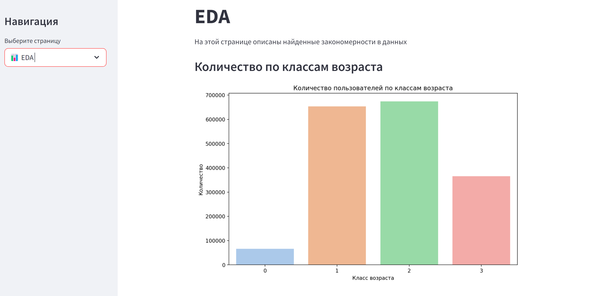

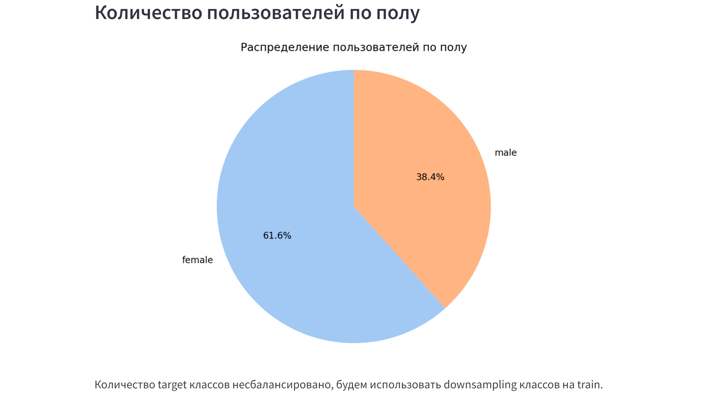

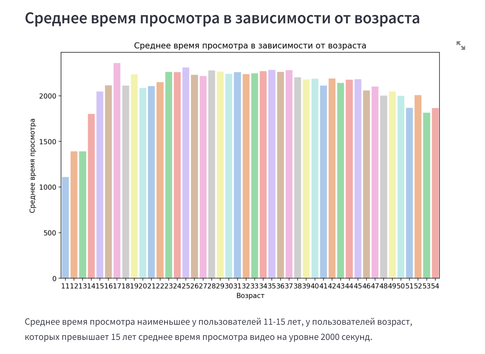

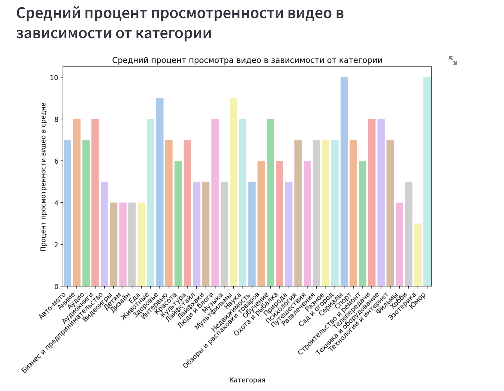

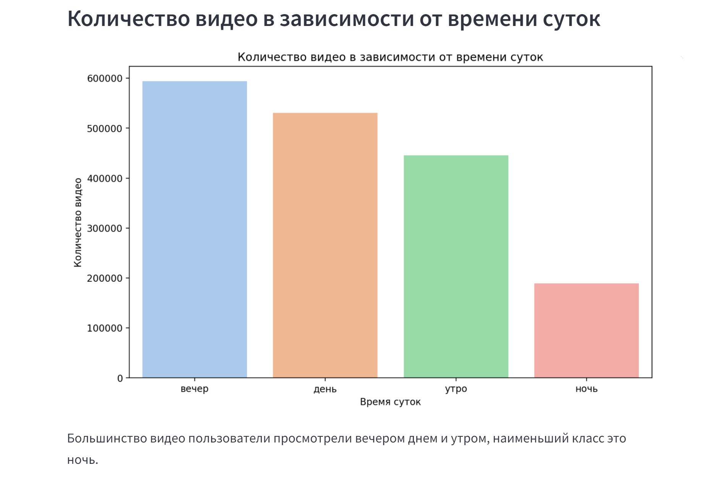

## Метрики после обучения модели 

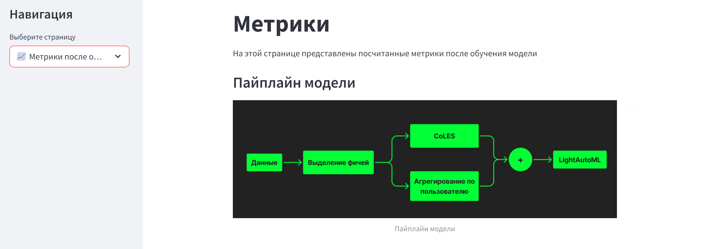

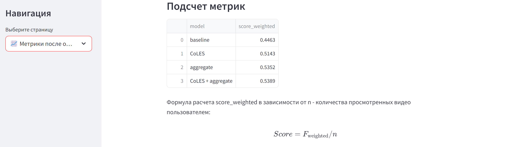

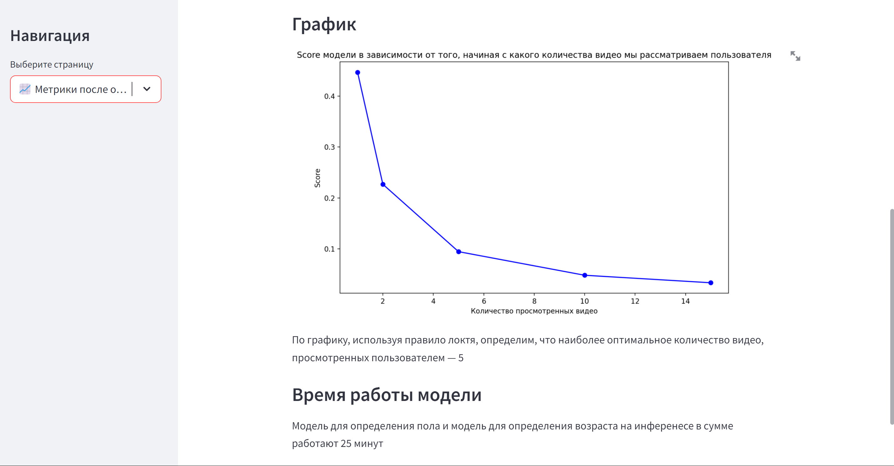

## Аналитика по названию дерева

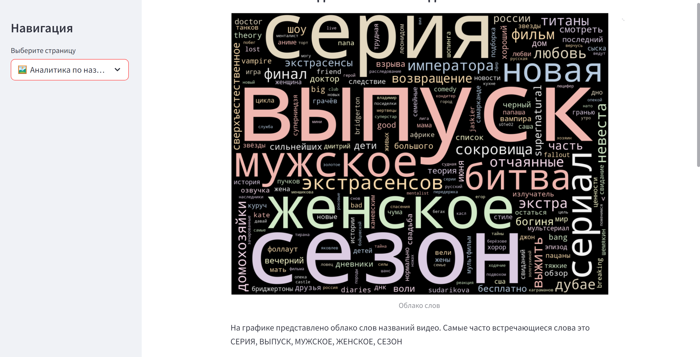
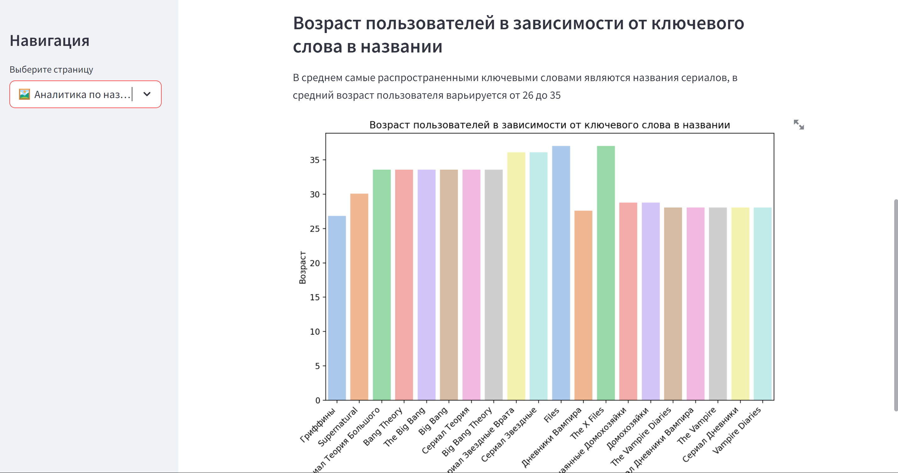

## Карты

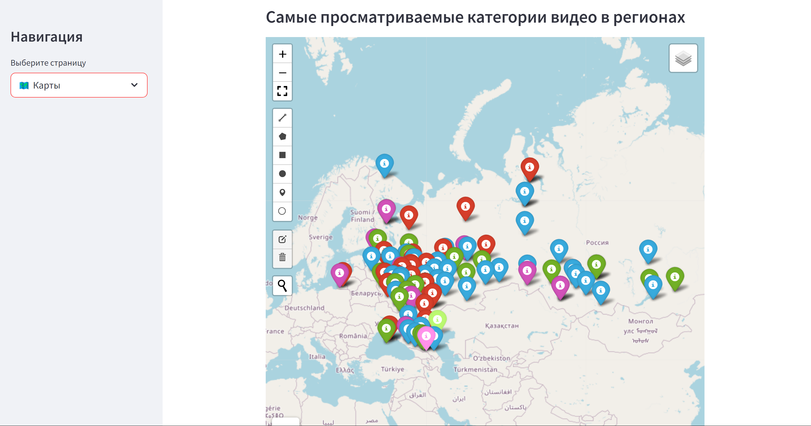


## Поиск мульти-пользователей 

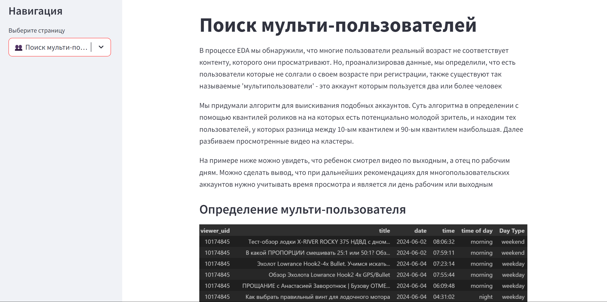

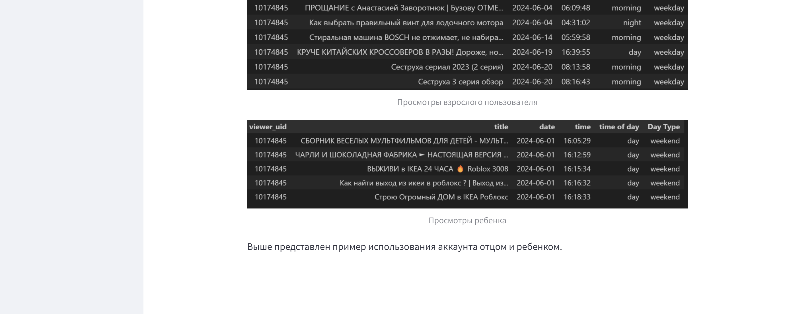
